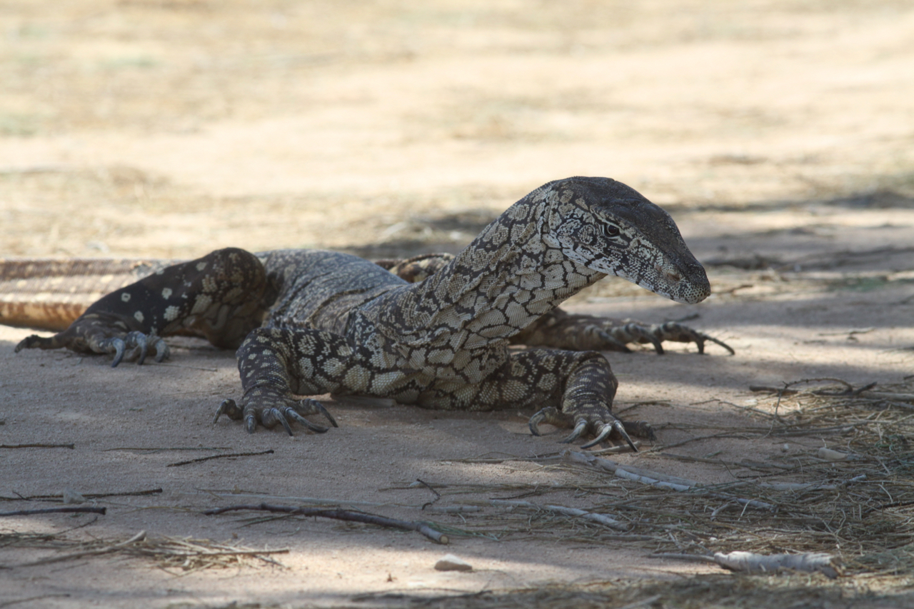

// add cover image to img directory and update filename below
ifdef::backend-html5[]

endif::backend-html5[]

== Colophon

//=== Suggested citation
Jörg Holetschek, Tim Robertson, Matthew Blissett. Advancing the IPT and BioCASe toolkits. GBIF Secretariat: Copenhagen. https://doi.org/10.35035/cdps-md62

=== Authors
Jörg Holetschek, https://orcid.org/0000-0001-6215-3617[Tim Robertson], https://orcid.org/0000-0003-0623-6682[Matthew Blissett]

//=== Contributors
//James Joyce and Samuel Beckett of Trinity College, Dublin, contributed to this version of the document.

=== Licence
The document _Advancing the IPT and BioCASe toolkits_ is licensed under https://creativecommons.org/licenses/by-sa/4.0[Creative Commons Attribution-ShareAlike 4.0 Unported License].

=== Persistent URI
https://doi.org/10.35035/cdps-md62

//=== Document control
//Third edition, April 2020

=== Cover image
Perentie (_Varanus giganteus_), Macleod, Washington, United States. Photo 2012 Tim Robertson via https://www.gbif.org/occurrence/2423018547[iNaturalist research-grade observations], https://creativecommons.org/publicdomain/zero/1.0/[CC0].
